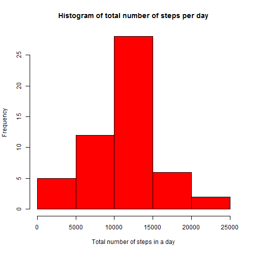
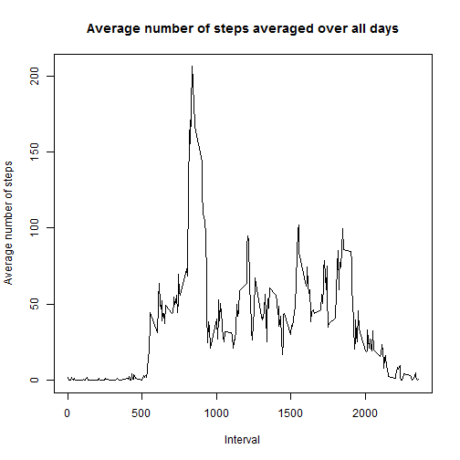
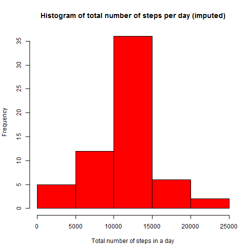
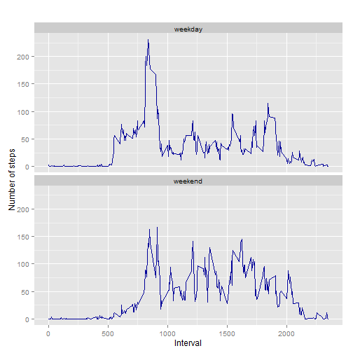

-----------------------------------------------------------

**Peer Assessment 1** 

**Loading and preprocessing the data**

Show any code that is needed to

1. Load the data (i.e. read.csv()).
2. Process/transform the data (if necessary) into a format suitable for your analysis.


```r
# set the file url 
fileurl <- "http://d396qusza40orc.cloudfront.net/repdata%2Fdata%2Factivity.zip"

# create a temporary directory
td = tempdir()

# create the placeholder file
tf = tempfile(tmpdir=td, fileext=".zip")

# download into the placeholder file (curl method needed for Mac OS X)
download.file(fileurl, tf)

# get the name of the first file in the zip archive
fname = unzip(tf, list=TRUE)$Name[1]

# unzip the file to the temporary directory
unzip(tf, files=fname, exdir=td, overwrite=TRUE)

# fpath is the full path to the extracted file
fpath = file.path(td, fname)

# load the csv in data frame
rdata <- read.csv(fpath, as.is=TRUE)
```

**What is mean total number of steps taken per day?**

For this part of the assignment, you can ignore the missing values in the dataset.

1. Make a histogram of the total number of steps taken each day.
2. Calculate and report the mean and median total number of steps taken per day.
3. Calculate and report the mean and median of the total number of steps taken per day.


```r
# omit rdata with incomplete value
rdata2 <- na.omit(rdata)

# aggregate steps per date and get total number of steps in a day
table_date_steps <- aggregate(steps ~ date, rdata2, sum)

# display histogram of total number of steps in a day
hist(table_date_steps$steps, col=2, main="Histogram of total number of steps per day", 
     xlab="Total number of steps in a day")
```

 

```r
steps_mean   <- mean(table_date_steps$steps)
steps_median <- median(table_date_steps$steps)
```
The `mean` is 10766 and the `median` is 10765.

**What is the average daily activity pattern?**

1. Make a time series plot (i.e. `type = "l"`) of the 5-minute interval (x-axis) and the average number of steps taken, averaged across all days (y-axis)

2. Which 5-minute interval, on average across all the days in the dataset, contains the maximum number of steps?


```r
# aggregate steps as interval and average number of steps in an interval across all days
table_interval_steps <- aggregate(steps ~ interval, rdata2, mean)

# display line plot of the 5-minute interval (x-axis) and the average number of 
# steps taken, averaged across all days (y-axis)
plot(table_interval_steps$interval, table_interval_steps$steps, type='l', col=1, 
     main="Average number of steps averaged over all days", xlab="Interval", 
     ylab="Average number of steps")
```

 

```r
max_interval <- table_interval_steps[which.max(table_interval_steps$steps),2]
```

On average, 206.1698113 contains the maximum number of steps across all the days in the dataset.

**Imputing missing values**

Note that there are a number of days/intervals where there are missing values (coded as NA). The presence of missing days may introduce bias into some calculations or summaries of the data.

1. Calculate and report the total number of missing values in the dataset (i.e. the total number of rows with NAs).

2. Devise a strategy for filling in all of the missing values in the dataset. The strategy does not need to be sophisticated. For example, you could use the mean/median for that day, or the mean for that 5-minute interval, etc.

3. Create a new dataset that is equal to the original dataset but with the missing data filled in.

4. Make a histogram of the total number of steps taken each day and Calculate and report the mean and4 median total number of steps taken per day. Do these values differ from the estimates from the first part of the assignment? What is the impact of imputing missing data on the estimates of the total daily number of steps?


```r
# incomplete row
rdata_NA <- rdata[!complete.cases(rdata),]

# number of rows
nrow(rdata_NA)
```

```
## [1] 2304
```
The total number of rows with NA's is **2304**  as shown above.

Performing imputation, replace NA value with mean for that 5-minute interval from "table_interval_steps"


```r
# imputation NA value
for (i in 1:nrow(rdata)){
  if (is.na(rdata$steps[i])){
    interval_val <- rdata$interval[i]
    row_id <- which(table_interval_steps$interval == interval_val)
    steps_val <- table_interval_steps$steps[row_id]
    rdata$steps[i] <- steps_val
  }
}

# aggregate steps per date and get total number of steps in a day - with new data set
table_date_steps_imputed <- aggregate(steps ~ date, rdata, sum)

# display histogram of total number of steps in a day - with new data set
hist(table_date_steps_imputed$steps, col=2, main="Histogram of total number of steps per day (imputed)", 
     xlab="Total number of steps in a day")
```

 

```r
steps_mean_imputed   <- mean(table_date_steps_imputed$steps)
steps_median_imputed <- median(table_date_steps_imputed$steps)
```
The orginal `mean` is 10766 **vs** imputed mean is 10766 and original `median` is 10765 **vs** the `imputed median` is 10766.

**Are there differences in activity patterns between weekdays and weekends?**

For this part the weekdays() function may be of some help here. Use the dataset with the filled-in missing values for this part.

1. Create a new factor variable in the dataset with two levels - weekday and weekend indicating whether a given date is a weekday or weekend day.
2. Make a panel plot containing a time series plot `(i.e. type = l)` of the 5-minute interval (x-axis) and the average number of steps taken, averaged across all weekday days or weekend days (y-axis).


```r
# convert from string to Date class
rdata$date <- as.Date(rdata$date, "%Y-%m-%d")

# new column indicating day of the week 
rdata$day <- weekdays(rdata$date)

# new column called day type (weekdat or weekend) and initialize to weekday
rdata$day_type <- c("weekday")

# Imark day_type as weekend
for (i in 1:nrow(rdata)){
  if (rdata$day[i] == "Saturday" || rdata$day[i] == "Sunday"){
    rdata$day_type[i] <- "weekend"
  }
}

# convert type day_time from character to factor
rdata$day_type <- as.factor(rdata$day_type)

# aggregate step interval and get average number of steps in an interval across all days
table_interval_steps_imputed <- aggregate(steps ~ interval+day_type, rdata, mean)

# load ggplot2 library
library(ggplot2)

qplot(interval, steps, data=table_interval_steps_imputed, geom=c("line"), xlab="Interval", 
      ylab="Number of steps", main="") + 
      facet_wrap(~ day_type, ncol=1) +
      geom_line(colour="#000099")
```

 

Re-clear memory


```r
# free memory
rm(rdata, rdata2, table_date_steps, table_interval_steps, rdata_NA, table_date_steps_imputed, 
   table_interval_steps_imputed)
```

----------------------------------------------------------- 

